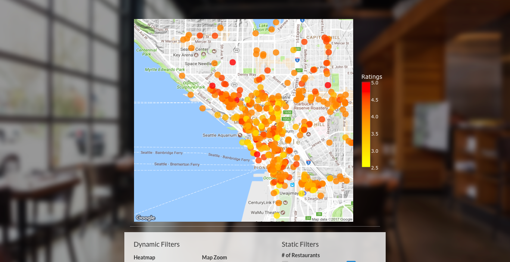

# Spring 2017 INFO201 Final Project - Foodie Map
## Team member: Kelden Lin, Emily Qiao, Chelsea Wang

"Foodie Map" is an application that organizes information for food-focused individuals using Yelp’s API by making data easily accessible to find trending establishments. By organizing data from collected through businesses associated with Yelp, we are striving to create a more accessible food map for both tourists and locals to find popular cuisine from the area. Unlike other services, this tool offers users the ability to visually see patterns in where restaurants by pricing, rating, review count.

Main Page: 

User can type in any address and enter the map which will show the heat map based on the address entered.
The default of "Surprise Me" was set to "University Way, Seattle"

Map:

The heat map created can show the users restaurants around the area. The color of the bubble can give our users a visual sense of the pricing, ratings, reviews for different restaurants

Filter:

We tailor the data we get from Yelp's API based on static filters and dynamic filters. Users can choose different cuisine types under select category, different price range, and minimum rating. The heatmap option includes rating, review count and pricing. 

We believe that by visually representing restaurants' data, we will provide our users the data they wanted at a glance. For instance, they can see the price trend from our map and choose the area they believe is a good fit for their budget. 

# [Check out our app by clicking here](https://kelden.shinyapps.io/foodie-map/)
